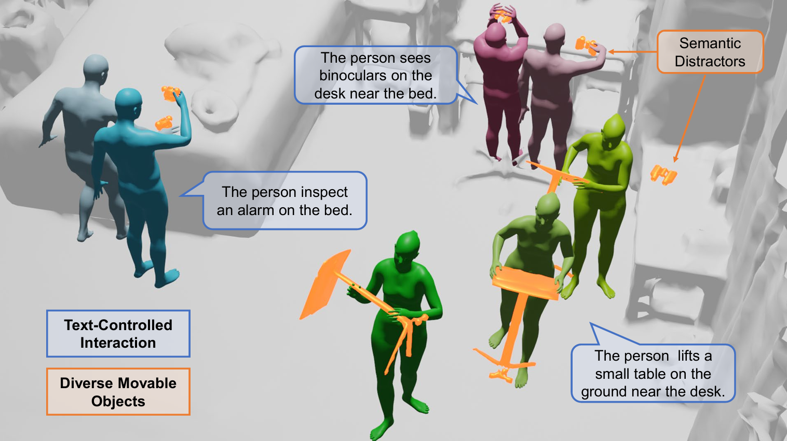

# InteractMove

[](https://cxhcmhhh.github.io/InteractMoveProject/static/pdfs/paper.pdf)
[](https://cxhcmhhh.github.io/InteractMoveProject/)
[](https://huggingface.co/datasets/cxhcmhhh/InteractMove)

This repository is the official Pytorch implementation for the paper **InteractMove: Text-Controlled Human-Object Interaction Generation in 3D Scenes with Movable Objects**.

In this paper, we propose a novel task of text-controlled human-object interaction generation in 3D scenes with movable objects. 
We construct the InteractMove dataset for Movable Human-Object Interaction in 3D Scenes by aligning existing human-object interaction data with scene contexts, featuring three key characteristics: 1) scenes containing multiple movable objects with text-controlled interaction specifications (including same-category distractors requiring spatial and 3D scene context understanding), 2) diverse object types and sizes with varied interaction patterns (one-hand, two-hand, etc.), and 3) physically plausible object manipulation trajectories. 
We first use 3D visual grounding models to identify the interaction object. Then, we propose a hand-object joint affordance learning to predict contact regions for different hand joints and object parts, enabling accurate grasping and manipulation of diverse objects. Finally, we optimize interactions with local-scene modeling and collision avoidance constraints, ensuring physically plausible motions and avoiding collisions between objects and the scene.

Our paper was accepted by ACM-MM 2025. 

[Paper](https://cxhcmhhh.github.io/InteractMoveProject/static/pdfs/paper.pdf) | 
[Project](https://cxhcmhhh.github.io/InteractMoveProject) |
[Dataset-HF](https://huggingface.co/datasets/cxhcmhhh/InteractMove)

<div align=center>

</div>

## Environment Setup

### Installation

1. Create a new conda env. and install `pytorch` with conda. Our `pytorch` version is 1.12.0 and `cuda` version is 12.5. 

```bash
conda create -n interactmove python=3.8
conda activate interactmove
conda install pytorch==1.12.0 torchvision==0.13.0 torchaudio==0.12.0 cudatoolkit=12.1 -c pytorch
```

2. Install other dependencies with `pip`.

```bash
pip install -r requirements.txt
```

### Data Preparation

1. Scenes

[ScanNet V2](http://www.scan-net.org/) dataset
    - In our implementation, we use the scenes with scan_id from `scene0000_00` to `scene0706_00`.

2. Aligned Motions

[Hugging Face](https://huggingface.co/datasets/cxhcmhhh/InteractMove)
    - Please download `InteractMove.zip` and unzip it to `root/data/InteractMove`.

3. Objects Meshes

[GRAB](https://github.com/otaheri/GRAB) dataset
[BEHAVE](https://github.com/xiexh20/behave-dataset) dataset

## Evaluation on Evaluation Set

### Train ADM

```bash
bash scripts/affordance/train_ddp.sh ${EXP_NAME} ${PORT}
```

### Train AMDM

```bash
bash scripts/motion/train_ddp.sh ${EXP_NAME} ${PORT}
```

### Evaluate

#### 0. Pretrained checkpoints download

[Google Drive](https://drive.google.com/drive/folders/1w8sLEl7XUJEI1XDO-D44Ls-7rf33wVCs?usp=sharing)
The ckpt structure should be:
```
-root
   |--outputs
        |--CDM-Perceiver-IM
            |--<model_name>.pt
        |--CMDM-Enc-IM
            |--<model_name>.pt
```

#### 1. Pre-generate affordance maps using the evaluation set

```bash
bash scripts/affordance/test.sh ${MODEL_DIR} ${RAND_SEED}
```

#### 2. Generate motion sequences using the evaluation set
  
```bash
bash scripts/motion/test.sh ${MODEL_DIR} ${AFFORD_DIR} ${RAND_SEED}
```
  - The arguments are the same as above
  - The calculated metrics are stored in `${MODEl_DIR}/eval/${test-MMDD-HHMMSS}/metrics.txt`


## Citation

If you find our project useful, please consider citing us.
```bib
@article{cai-etal-2025-interactmove,
      title={InteractMove: Text-Controlled Human-Object Interaction Generation in 3D Scenes with Movable Objects},
      author={Xinhao Cai and Minghang Zheng and Xin Jin and Yang Liu},
      journal={Proceedings of the 32nd ACM International Conference on Multimedia},
      year={2025}
    }
```

### Acknowledgement

Partial code is borrowed from [MDM](https://github.com/GuyTevet/motion-diffusion-model), [HumanML3D](https://github.com/EricGuo5513/text-to-motion), [HUMANISE](https://github.com/Silverster98/HUMANISE) and [Afford-Motion](https://github.com/afford-motion/afford-motion).

### License

This project is licensed under the MIT License. See [LICENSE](LICENSE) for more details.
